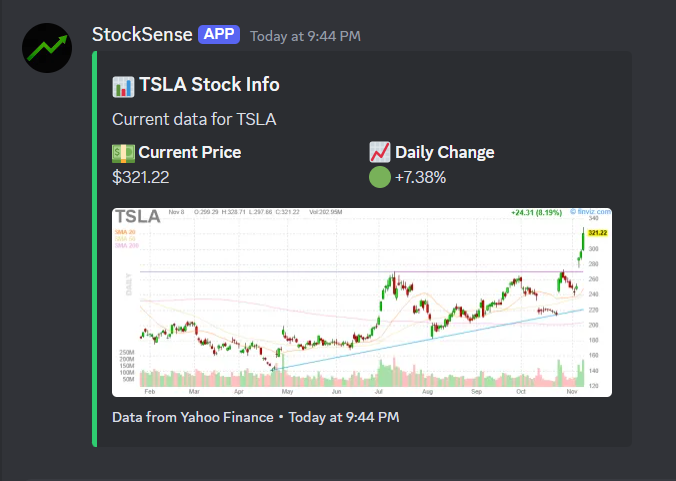

# StockSense | Discord Bot

**StockSense** is a Discord bot that helps users track and monitor their stock portfolio directly within Discord. With real-time stock data and stock-related news, it keeps users updated on their investments and helps them stay informed.

## Features
- Track stocks in your portfolio and store them in an **SQLite** database.
- Fetch **real-time stock data** using the **Yahoo Finance API**.
- Retrieve the latest **stock-related news** from the **Google News API**.
- **CRUD functionality**: Add, update, view, or remove stocks from the portfolio.
- Available 24/7 via hosting on **Replit**.
- Built using **Python** and the **Discord API**
  
## Screenshot

Here’s what the bot interface looks like in Discord:

  
  

